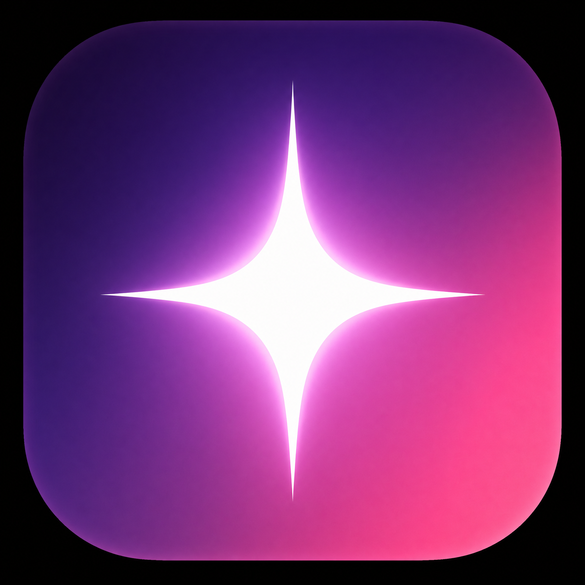
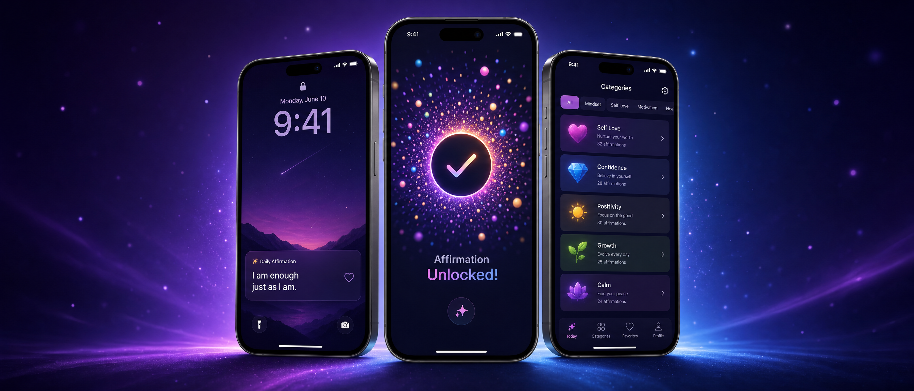
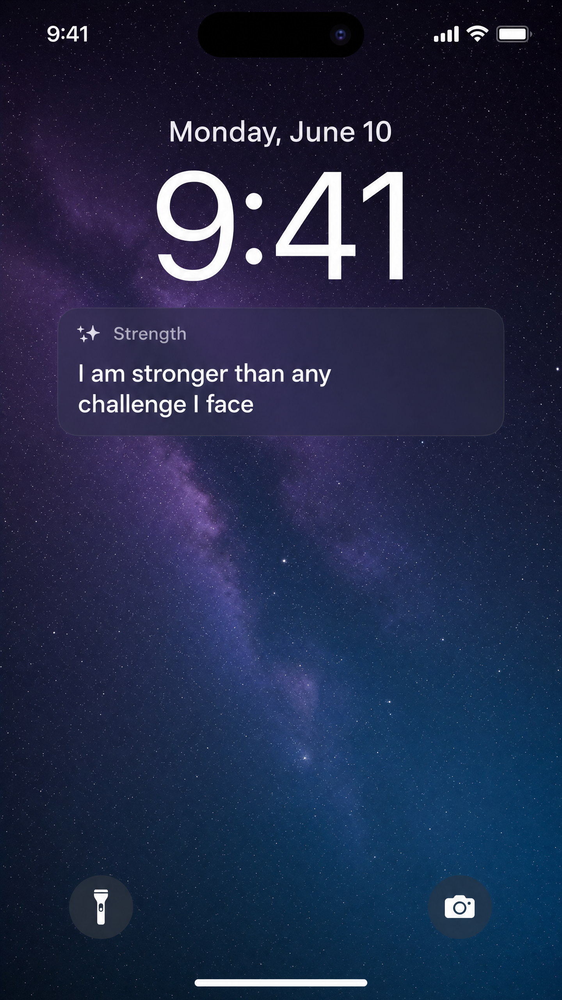
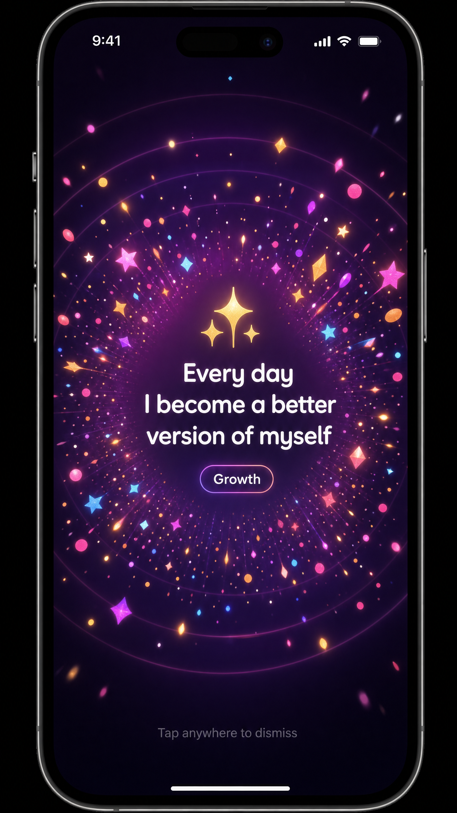
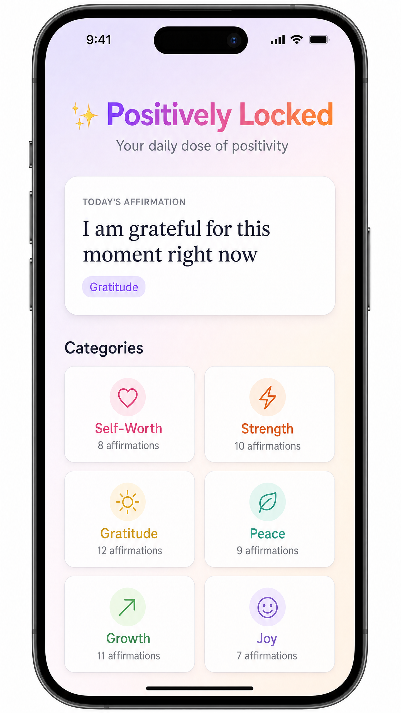
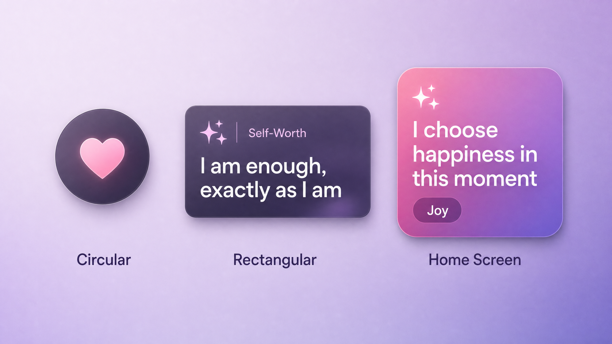
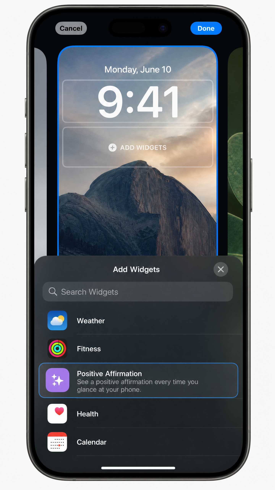
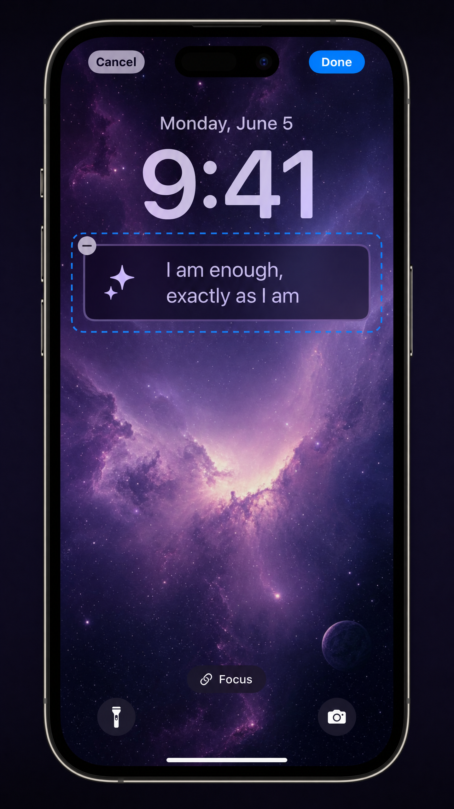

<p align="center">
  
</p>

<h1 align="center">Positively Locked</h1>

<p align="center">
  <strong>Your daily dose of positivity, right on your Lock Screen</strong>
</p>

<p align="center">
  
  
  
  
  
</p>

<p align="center">
  
</p>

---

## What is Positively Locked?

**Positively Locked** is a focused iOS application that does one thing beautifully: it displays a positive affirmation on your Lock Screen every time you pick up your phone, and rewards you with a stunning celebration animation when you unlock it.

No social feeds. No notifications. No distractions. Just a moment of positivity every time you reach for your device.

---

## Screenshots

<p align="center">
  
  &nbsp;&nbsp;&nbsp;
  
  &nbsp;&nbsp;&nbsp;
  
</p>

<p align="center">
  <em>Lock Screen Widget &nbsp;|&nbsp; Unlock Celebration &nbsp;|&nbsp; Main App</em>
</p>

---

## Widget Gallery

<p align="center">
  
</p>

Three widget styles to choose from: **Circular** (icon only), **Rectangular** (full affirmation), and **Home Screen** (gradient card).

---

## Features

| Feature | Description |
|---------|-------------|
| **Lock Screen Widget** | See a positive affirmation every time you pick up your phone |
| **Unlock Animation** | Enjoy a particle celebration with haptic feedback when you unlock |
| **48 Affirmations** | Curated across 6 categories: Self-Worth, Strength, Gratitude, Peace, Growth, Joy |
| **Auto-Refresh** | New affirmation every 30 minutes on the Lock Screen |
| **Category Filtering** | Choose which type of affirmation speaks to you |
| **Haptic Feedback** | Synchronized tactile response during the celebration |
| **Zero Permissions** | No camera, no microphone, no location, no network |
| **Privacy First** | All data stays on your device, nothing leaves your phone |

---

## How It Works

```
┌─────────────────┐     ┌──────────────────┐     ┌─────────────────────┐
│  Pick Up Phone  │────▶│  See Affirmation  │────▶│  Unlock = Celebrate │
│  (Raise to Wake)│     │  (Lock Screen)    │     │  (Animation + Haptic)│
└─────────────────┘     └──────────────────┘     └─────────────────────┘
```

1. **Pick up your phone** — iOS "Raise to Wake" lights up the screen
2. **See your affirmation** — The Lock Screen widget displays today's positive message
3. **Unlock your phone** — A beautiful particle animation celebrates the moment
4. **Fresh content** — A new affirmation is prepared for next time

---

## Quick Start

### Prerequisites

- Xcode 15.0 or later
- iOS 17.0+ device or simulator
- Apple Developer account (for device testing)

### Installation

```bash
# Clone the repository
git clone https://github.com/YOUR_USERNAME/PositivelyLocked.git

# Open in Xcode
cd PositivelyLocked
open PositivelyLocked.xcodeproj
```

### Setup

1. Select the `PositivelyLocked` target → Signing & Capabilities → Set your team
2. Select the `AffirmationWidgetExtension` target → Signing & Capabilities → Set your team
3. Build and run (⌘R)
4. Add the widget to your Lock Screen (see [Widget Setup Guide](../../wiki/Widget-Setup-Guide))

---

## Adding the Widget

<p align="center">
  
  &nbsp;&nbsp;&nbsp;&nbsp;
  
</p>

1. Long-press your Lock Screen → Tap **Customize**
2. Tap the widget area below the clock
3. Search for **"Positive Affirmation"**
4. Select your preferred widget style
5. Tap **Done**

---

## Architecture

```
PositivelyLocked/
├── PositivelyLocked.xcodeproj/      # Xcode project
├── PositivelyLocked/                 # Main app target
│   ├── PositivelyLockedApp.swift    # Entry point + scene phase detection
│   ├── AppState.swift               # Observable state management
│   ├── ContentView.swift            # Main UI with categories
│   ├── UnlockAnimationView.swift    # Particle celebration system
│   ├── HapticManager.swift          # Tactile feedback
│   └── NotificationManager.swift    # Widget refresh coordination
├── AffirmationWidget/                # WidgetKit extension
│   └── AffirmationWidget.swift      # All widget sizes and views
├── Shared/                           # Shared between targets
│   └── AffirmationManager.swift     # Affirmation data + App Group storage
└── docs/                             # Documentation and screenshots
```

---

## Technical Stack

| Component | Technology |
|-----------|-----------|
| UI Framework | SwiftUI |
| Widget System | WidgetKit (iOS 17+) |
| Data Sharing | App Groups (UserDefaults) |
| Animations | SwiftUI Animations + Custom Shape Paths |
| Haptics | UIImpactFeedbackGenerator |
| Architecture | MVVM with ObservableObject |
| Minimum Target | iOS 17.0 |
| Swift Version | 5.9 |

---

## Customization

### Add Your Own Affirmations

Edit `Shared/AffirmationManager.swift`:

```swift
static let affirmations: [String: [String]] = [
    "Your Category": [
        "Your custom affirmation here",
        "Another affirmation",
    ],
    // ...existing categories
]
```

### Modify the Animation

Edit `UnlockAnimationView.swift` to customize:
- **Particle count**: Change `40` in `generateParticles()`
- **Colors**: Modify the `particleColors` array
- **Timing**: Adjust delays in `startAnimation()`
- **Shapes**: Add new `Shape` conformances

### Change Widget Refresh Rate

In `AffirmationWidget.swift`, modify the timeline:

```swift
// Change from 30 minutes to your preferred interval
for hourOffset in 0..<48 {
    let entryDate = Calendar.current.date(
        byAdding: .minute,
        value: hourOffset * 30,  // ← Change this value
        to: currentDate
    )!
}
```

---

## Privacy & Permissions

Positively Locked is designed with privacy as a core principle:

- **No network requests** — Everything runs locally
- **No tracking** — No analytics, no telemetry
- **No personal data** — Only stores your selected affirmation preference
- **No permissions required** — No camera, microphone, location, or contacts
- **App Group only** — Data shared between app and widget stays on-device

---

## Contributing

Contributions are welcome! Here's how you can help:

1. Fork the repository
2. Create a feature branch (`git checkout -b feature/amazing-affirmation`)
3. Commit your changes (`git commit -m 'Add amazing affirmation category'`)
4. Push to the branch (`git push origin feature/amazing-affirmation`)
5. Open a Pull Request

### Ideas for Contributions

- Additional affirmation categories (e.g., Creativity, Relationships, Health)
- New animation styles for the unlock celebration
- Localization support for other languages
- Apple Watch complication support
- Siri Shortcuts integration

---

## License

This project is licensed under the MIT License - see the [LICENSE](LICENSE) file for details.

---

<p align="center">
  <strong>Made with love and positive energy</strong>
  <br>
  <em>Start every phone pickup with intention</em>
</p>
